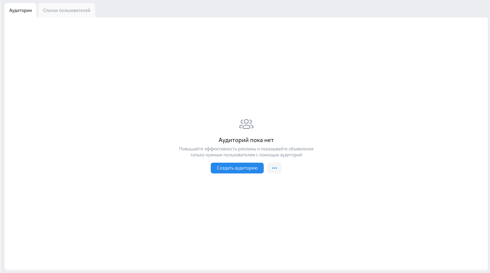
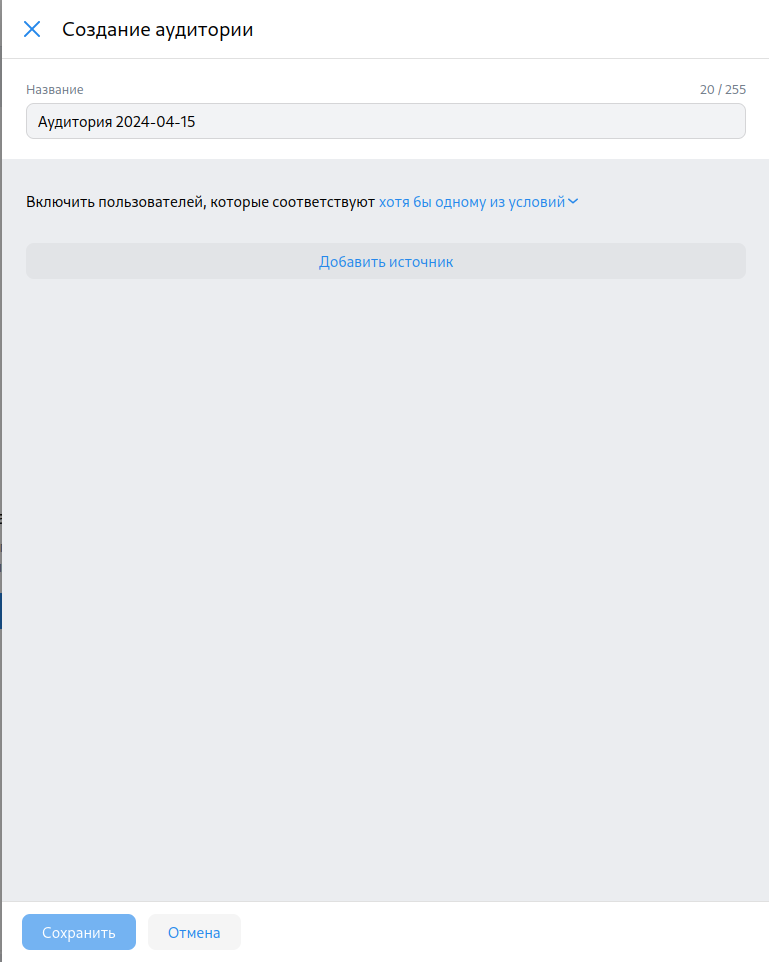
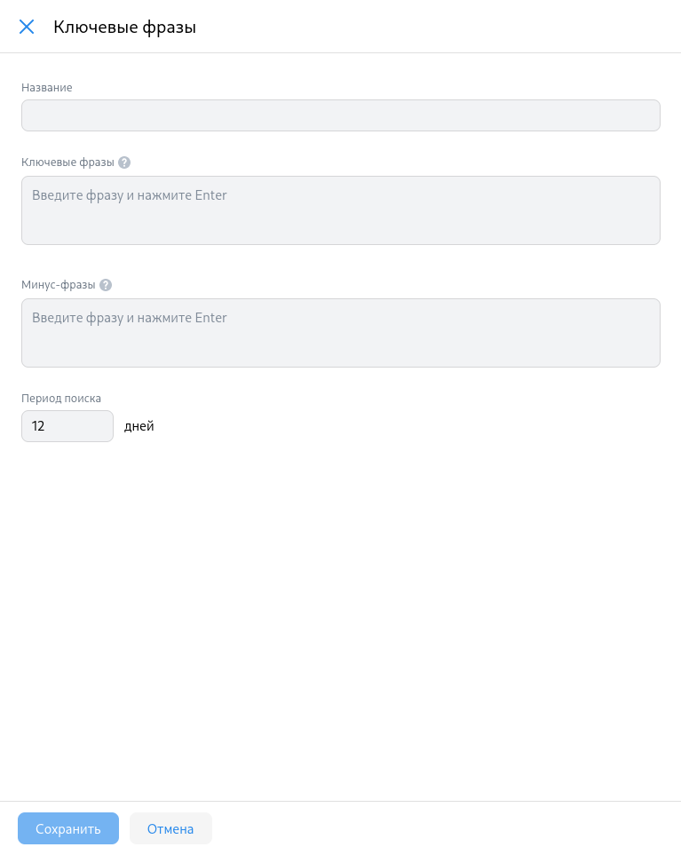
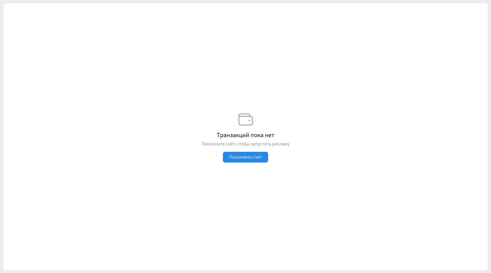
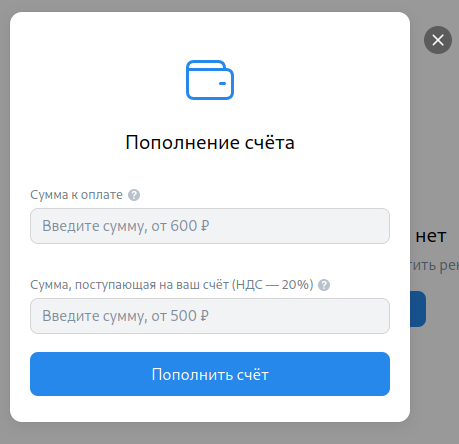
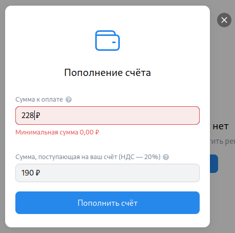
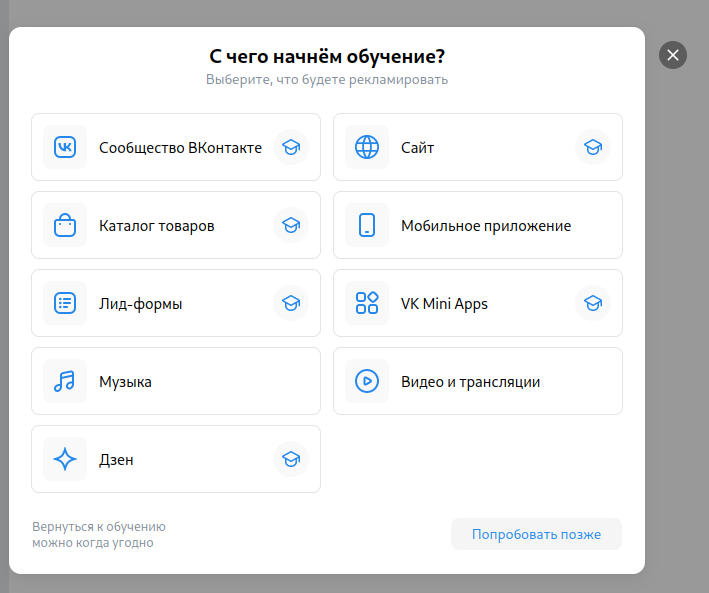

# Чек-листы ads.vk.com

## Аудитории
[/hq/audience](https://ads.vk.com/hq/audience)

- Аудитории. При нажатии "Создать аудиторию" появляется окно справа "Создание аудитории"

- Создание Аудитории. При нажатии на кнопку "Добавить источник" к окну справа добавляется окно "Включить источник"
- Создание Аудитории. Добавление источника. При нажатии на кнопку "Ключевые фразы" окно "Включить источник" заменяется на окно "Ключевые фразы" с полями ввода "Название", "Ключевые фразы", "Минус фразы", "Период поиска"

- Создание Аудитории. Добавление источника. Ключевые фразы. Кнопка "Сохранить" не активна если не заполнены поля "Ключевые фразы" или "Минус фразы"
- Создание Аудитории. Добавление источника. Ключевые фразы. При заполнении хотя бы поля "Ключевые фразы" и нажатии кнопки сохранить, окно закрвывается и в списе аудиторий отображается новосозданная с заголовком "Ключевые фразы" и заполнеными полями

- Создание Аудитории. Добавление источника. Ключевые фразы. Если ввести в поле "Период поиска" число меньше или равное 0, то через секунду оно заменится на 1
- Создание Аудитории. Добавление источника. Ключевые фразы. Если ввести текст в поле "Минус фразы" и нажать кнопку "Сохранить", то на поле "Ключевые фразы" появится сообщение "Обязательное поле"

## Бюджет
[/hq/budget/transactions](https://ads.vk.com/hq/budget/transactions)

- Бюджет. При нажатии на кнопку "Пополнить счёт" открывается модальное окно "Пополнение счёт" с полями ввода "Сумма к оплате" и "Сумма поступившая на ваш счет"

- Пополнение счета. При вводе суммы не меньше 600 руб. в поле "Сумма к оплате" и нажатии кнопку "Пополнить счёт" открывается окно "Пополнение рекламного счета" с кнопкой "Оплатить <введенная сумма> ₽"
- Пополнение счета. При вводе суммы не меньше 500 руб. в поле "Сумма поступившая на ваш счет" и нажатии кнопку "Пополнить счёт" открывается окно "Пополнение рекламного счета" с кнопкой "Оплатить <сумма которая была в поле "Сумма к оплате"> ₽"

- Пополнение счета. При вводе суммы меньше 600 руб. в поле "Сумма к оплате" появляется надпись "Минимальная сумма 0,00 ₽"
- Пополнение счета. При вводе суммы мешьше 500 руб. в поле "Сумма поступившая на ваш счет" и нажатии кнопку "Пополнить счёт" появляется надпись "Минимальная сумма 0,00 ₽"

## Обучение

- Обучение. При нажатии не на окно обучения окно закрывается
- Обучение. При нажатии на кнопку креста окно закрывается
- Обучение. При нажатии на кнопку "Попробывать позже" окно закрывается

- Обучение. При нажатии на кнопку "Сообщество ВКонтакте" открывается модальное окно "Как хотите учится?"
- Обучение.Сообщество ВКонтакте. При нажатии на кнопку "Смотреть видеоурок от экспертов VK", окно меняется на окно с видеоуроком
- Обучение.Сообщество ВКонтакте. При нажатии на кнопку "Смотреть курс на обучающей платформе" происходит переход на страницу обучающей платформы
- Обучение.Сообщество ВКонтакте. При нажатии на кнопку на "Настроить кампанию с подсказками", открывается страница компаний где есть подсказка "Создание кампании"

- Обучение.Сообщество ВКонтакте. При наведении курсора на "Настроить кампанию с подсказками" появляется попап с сообщение "Этот тип обучения пока недоступен" если сообщество ВКонтакте рекламодателя не создано
